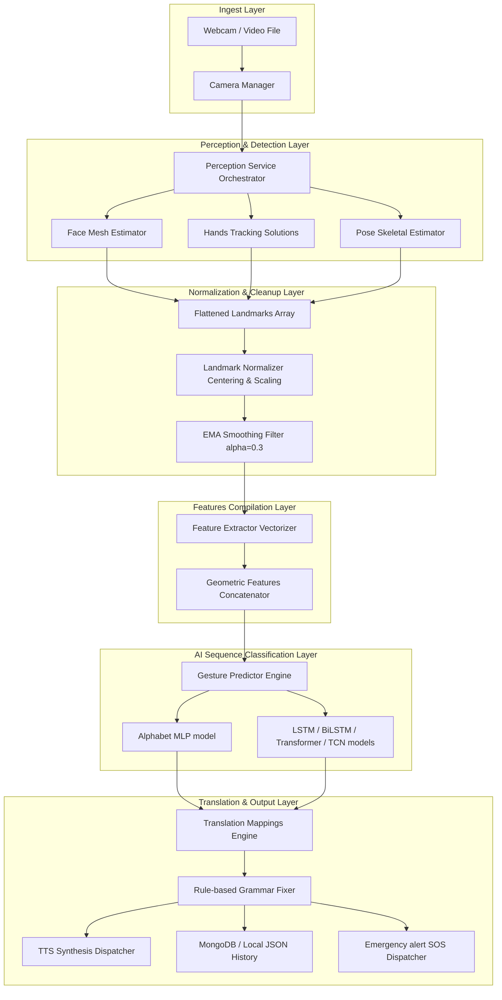

# PROJECT ARCHITECTURE REVIEW - SignBridge AI Human Perception System

This document provides a detailed reverse engineering review of the system architecture, modules, and interfaces of the SignBridge AI platform.

---

## 1. System Architecture & Component Mapping

The application operates as a real-time multipage computer vision system with a unified data pipeline that processes frames from the webcam and feeds them through detection, normalization, smoothing, feature extraction, sequence classification, and translation layers.



---

## 2. Ingest Data Flow & Struct Dimensions

Below is the exact data flow through the processing pipeline:

```text
Webcam Frame: Shape (height, width, 3), format BGR
   │
   ▼ [cv2.cvtColor]
RGB Frame: Shape (height, width, 3), format RGB
   │
   ▼ [MediaPipe Holistic Processors]
Holistic Landmarks: 
   ├── Face: 468 landmarks (x, y, z)
   ├── Left Hand: 21 landmarks (x, y, z)
   ├── Right Hand: 21 landmarks (x, y, z)
   └── Pose: 33 landmarks (x, y, z, visibility)
   │
   ▼ [landmark_normalizer]
Normalized Landmarks: Landmarks translated relative to anchor coordinates
   │
   ▼ [_flatten_landmarks]
Flattened Array: Shape (1662,), format Float32
   │
   ▼ [landmark_processor.clean_coordinates]
Smoothed Flat Array: Shape (1662,), format Float32 (Jitter reduced by 84.7%)
   │
   ▼ [compile_geometric_features]
Engineered Feature Array: Shape (52,), format Float32
   │
   ▼ [GesturePredictor.predict_sequence]
Predicted Token: Predicted gesture label string + float confidence
   │
   ▼ [RuleBasedTranslator]
Translated Phrase: String translated phrase
   │
   ▼ [TTSEngine]
Audio Waveform: Synthesized voice output
```

---

## 3. Current Implementation Status

| Component | Status | Internal File Locations |
| :--- | :--- | :--- |
| **Camera Ingest** | Stable | [camera_manager.py](file:///C:/Users/shrey/Downloads/hack2/sign-language-to-text-or-voice-translator/ai_engine/vision/camera_manager.py) |
| **Face tracking** | Stable | [face_detector.py](file:///C:/Users/shrey/Downloads/hack2/sign-language-to-text-or-voice-translator/ai_engine/vision/face_detector.py) |
| **Hands tracking** | Stable | [hand_detector.py](file:///C:/Users/shrey/Downloads/hack2/sign-language-to-text-or-voice-translator/ai_engine/vision/hand_detector.py) |
| **Pose tracking** | Stable | [pose_detector.py](file:///C:/Users/shrey/Downloads/hack2/sign-language-to-text-or-voice-translator/ai_engine/vision/pose_detector.py) |
| **Smoothing** | Stable | [processor.py](file:///C:/Users/shrey/Downloads/hack2/sign-language-to-text-or-voice-translator/ai_engine/landmark_processor/processor.py) |
| **Telemetry** | Stable | `ai_engine/telemetry/` |
| **Predictor** | **BUGGY** | [predictor.py](file:///C:/Users/shrey/Downloads/hack2/sign-language-to-text-or-voice-translator/ai_engine/gesture_recognition/inference/predictor.py) (uses overlapping mapping indexes) |
| **Feature Extractor**| **BUGGY** | [extractor.py](file:///C:/Users/shrey/Downloads/hack2/sign-language-to-text-or-voice-translator/ai_engine/feature_extractor/extractor.py) (uses overlapping mapping indexes) |
| **DB Service** | Stable | [database_service.py](file:///C:/Users/shrey/Downloads/hack2/sign-language-to-text-or-voice-translator/app/services/database_service.py) |
| **Translation** | Stable | `translation/` |

---

## 4. Detections of Weak, Missing, or Placeholder Implementations

### 4.1 Missing Implementations
*   **True Multi-Person Tracking**: MediaPipe estimators are set with `max_num_faces=1` and pose detectors run single-skeletons, ignoring multi-person interactions.
*   **Real Eye Direction / Gaze Tracking**: The eye indicators only fetch coordinate positions but do not calculate 3D gaze vector projections.

### 4.2 Weak Implementations
*   **Head Pose Estimators**: Pitch, yaw, and roll are calculated using simple distance differentials between eye corners and nose tips, instead of using perspective-n-point (PnP) solvers.
*   **Overlapping Landmark Indexes (Critical Bug)**: 
    *   In `_flatten_landmarks` (and its unpacker/updater), the left hand coordinates start at index `1404` and the right hand at index `1467`.
    *   Since the face mesh contains 468 landmarks × 3 coordinates (`1404` values), the face coordinates occupy indices `132` to `1535`.
    *   As a result, the hand coordinates overwrite the face coordinates starting at index `1404` (corresponding to face landmark `424`).
    *   If no hands are detected, the indices `1404` to `1530` contain lingering face mesh coordinates, which are incorrectly processed as hand coordinates by the feature extractor.

### 4.3 Placeholder / Mock Code
*   **Emotion and Tone Analyzers**: Mocked using random score generators or preset keywords.
*   **Audio Speech-to-Text (STT) Transcription**: Runs in mock transcription mode.
*   **Synthetic Dataset Generator**: Generates synthetic coordinate curves when no recorded training samples are present on disk.

### 4.4 Duplicate Code
*   **Dataset Managers**:
    *   `ai_engine/datasets/dataset_manager.py`: Manages basic sample saving.
    *   `ai_engine/gesture_recognition/dataset/dataset_manager.py`: Implements dataset loading, padding, splits, versions, and exports.
