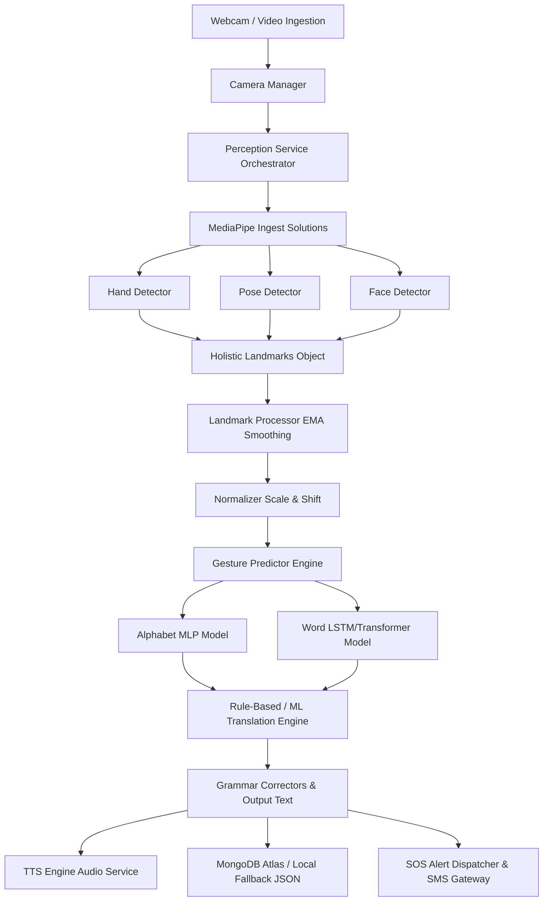

# SYSTEM ARCHITECTURE - SignBridge AI Reconstruction Blueprint

This document details the multi-layered system architecture of the SignBridge AI application.

---

## 1. High-Level System Architecture

The project follows a decoupled multi-page architecture centered around a core AI telemetry engine. The primary user interface is built using Streamlit, with an optional React frontend (Vite) and FastAPI backend for external sockets data ingestion.

---

## 2. Component Architectures

### 2.1 Frontend Architecture (Streamlit Router)
*   **Routing System**: Structured around Streamlit's `st.navigation` and `st.Page` registry in [app/main.py](file:///C:/Users/shrey/Downloads/hack2/sign-language-to-text-or-voice-translator/app/main.py).
*   **State Machine**: Streamlit session state variable (`st.session_state`) handles:
    *   `authenticated`: Toggles view permissions.
    *   `auth_step`: Centered Splash screen navigation.
    *   `chart_latency` / `chart_confidence`: Appends historical telemetry stats.
    *   `sequence_buffer`: Array tracking the latest 30 frames coordinates.

### 2.2 Backend & WebSockets (`backend/`)
*   **FastAPI Framework**: Runs on Uvicorn, serving token validations and status requests.
*   **WebSocket Ingestion**: [backend/ws/telemetry_socket.py](file:///C:/Users/shrey/Downloads/hack2/sign-language-to-text-or-voice-translator/backend/ws/telemetry_socket.py) establishes persistent connections to feed coordinate arrays from external tracking systems.

### 2.3 Computer Vision Pipeline (`ai_engine/vision/`)
*   **Orchestration**: The `PerceptionService` receives a frame from `CameraManager`, passes it to the MediaPipe detectors, and aggregates details in the `TelemetryData` schema.
*   **Multi-Detector Sub-grid**:
    *   `HandDetector`: Tracks 21 coordinates per hand.
    *   `PoseDetector`: Focuses on upper body joints (shoulders, elbows).
    *   `FaceDetector`: Extracts head pitch, yaw, and mouth open indicators.

### 2.4 AI Gesture Classifier Architecture
*   **Features Pipeline**:
    *   `LandmarkFeatures`: Extracts distance-based vectors.
    *   `MotionFeatures`: Tracks velocity across adjacent frames.
    *   `TemporalFeatures`: Aggregates trends over the sequence window.
*   **Sequence Models**: Defined in [ai_engine/gesture_recognition/models/word_model.py](file:///C:/Users/shrey/Downloads/hack2/sign-language-to-text-or-voice-translator/ai_engine/gesture_recognition/models/word_model.py):
    *   **LSTM / BiLSTM**: Recurrent layers for time-series memory.
    *   **Transformer**: Self-attention mapping over the temporal sequence.
    *   **TCN**: Temporal Convolutional Network filters.

### 2.5 Database & Offline Fallback Architecture
*   **Atlas Collection Mappings**: Logs translations to `translation_history` and performance metrics to `system_analytics`.
*   **Resiliency Handler**: When Atlas pings fail, `DatabaseService` redirects writes to the local local JSON file `offline_history.json`.

### 2.6 Emergency SOS System
*   **SOS Monitoring**: Runs concurrently inside the gesture and translation pipelines.
*   **SOS Indicators**:
    *   *Visual*: Specific gestures matching distress patterns (e.g., continuous fist occlusion).
    *   *Textual*: Trigger phrases parsed by the grammar fixer.
*   **SMS Dispatcher**: Integrates Twilio/HTTP gateways to alert predefined emergency contacts with time and status.
