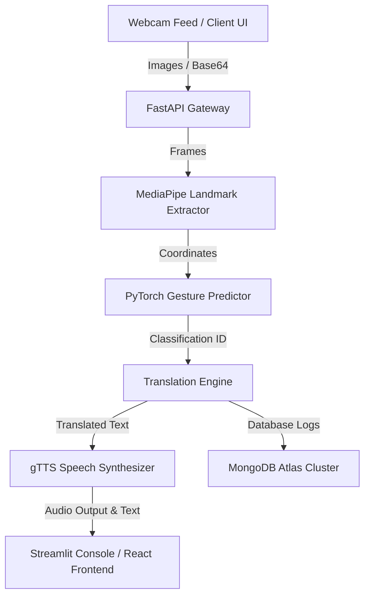

# SignBridge AI: Real-Time ASL Gesture Translation System

SignBridge AI is an enterprise-grade, accessibility-first communication portal designed to bridge the gap between American Sign Language (ASL) users and spoken language speakers. Utilizing high-fidelity computer vision pipelines, deep learning sequence prediction, and robust API endpoints, SignBridge AI provides seamless real-time sign-to-text and sign-to-speech translation.

---

## 🌟 Features

- **Real-Time Landmark Perception**: High-precision hand tracking, face mesh tracking, eye tracking, and body pose tracking powered by MediaPipe.
- **Deep Learning Gesture Recognition**: Multi-frame temporal sequence classification using PyTorch.
- **Multilingual Vocalization**: Integrated translation engine supporting 16 languages (English, Hindi, Telugu, Spanish, French, German, Chinese, Japanese, Arabic, Portuguese, Russian, Italian, Korean, Bengali, Tamil, Urdu) powered by Google Text-to-Speech (gTTS).
- **Secure Authentication System**: JWT-token based secure registration, login, session management, and role-based access control (User/Admin).
- **Interactive Telemetry Dashboard**: Real-time analytics, user translation histories, and export controls (JSON/CSV) for data compliance.
- **Accessibility-First Design**: Dynamic theme management (Dark/Light mode) and fully customizable contrast and typography controls.

---

## 🏗️ Architecture



### Technical Stack
* **Frontend**: React (Vite, Tailwind UI) + Streamlit Developer Console
* **Backend**: FastAPI (Python 3.12)
* **Database**: MongoDB Atlas (NoSQL)
* **AI/CV Engine**: MediaPipe (Hand/Face/Pose landmark tracking), PyTorch (Sequence Classifiers), NumPy
* **Quality & Verification**: Ruff, Mypy, Bandit, Semgrep, Vulture, Pytest, Pytest-Cov

---

## 🚀 Installation & Setup

### Prerequisites
- Python 3.12+
- Node.js 18+ (for Vite frontend)
- MongoDB Atlas account (or local MongoDB instance)

### 1. Clone the Repository
```bash
git clone https://gitlab.example.com/signbridge/sign-language-to-text-or-voice-translator.git
cd sign-language-to-text-or-voice-translator
```

### 2. Backend Environment Setup
Create a Python virtual environment and install dependencies:
```bash
cd backend
python -m venv .venv
.\.venv\Scripts\activate
python -m pip install --upgrade pip
pip install -r requirements.txt
pip install -r ../requirements-dev.txt
```

Create a `.env` configuration file in the `backend/` directory (see [.env.example](file:///.env.example) for reference):
```env
MONGO_URI=mongodb+srv://<username>:<password>@cluster0.example.com/signbridge
JWT_SECRET=super_secret_jwt_sign_key_change_in_production
PORT=8000
```

### 3. Frontend Environment Setup
Install Node dependencies:
```bash
cd ../frontend
npm install
```

---

## 💻 Running the Application

### Start the Backend API Server
Activate the virtual environment and run FastAPI with Uvicorn:
```bash
cd backend
.\.venv\Scripts\activate
uvicorn app.main:app --host 0.0.0.0 --port 8000 --reload
```

### Start the Streamlit AI Console
To run the developer perception dashboard:
```bash
cd ..
backend\.venv\Scripts\python.exe -m streamlit run app/main.py --server.port 8501
```

### Start the React Web Interface
To run the production-like UI:
```bash
cd frontend
npm run dev -- --host 0.0.0.0 --port 4173
```

---

## 📊 API Reference

| Endpoint | Method | Authentication | Description |
| :--- | :--- | :--- | :--- |
| `/api/auth/register` | `POST` | None | Register a new user account |
| `/api/auth/login` | `POST` | None | Authenticate and obtain JWT token |
| `/api/auth/logout` | `POST` | JWT Bearer | Invalidate client session token |
| `/api/translate` | `POST` | JWT Bearer | Translate sign language image to text/speech |
| `/api/history` | `GET` | JWT Bearer | Retrieve translation history |
| `/api/admin/analytics` | `GET` | Admin Bearer | Retrieve system usage statistics |

---

## 🛠️ Development & Quality Gates

To run static lint checks, type validators, and safety checks before submitting code:

```bash
# Linting
ruff check .

# Type Checking
mypy .

# Security Scans
bandit -r .

# Dead-code scanning
vulture .

# Unit Tests & Coverage
pytest --cov=backend --cov=ai_engine --cov=translation --cov-report=term-missing
```

---

## 📜 License

This project is licensed under the **GNU Affero General Public License v3.0** (AGPLv3). Under this license, if you modify the code and run it as a network service, you must make your modifications available to the public. See the [LICENSE](file:///LICENSE) file for details.
