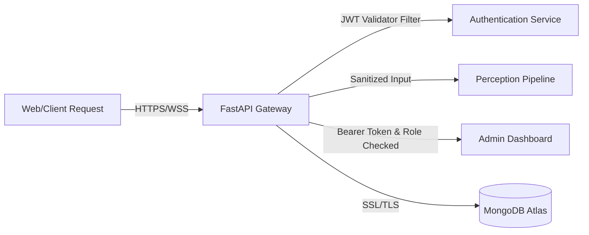

# SignBridge AI: Security Audit & Threat Modeling

This document outlines the security architecture, authentication boundaries, data protection mechanisms, and results of automated security auditing within the SignBridge AI codebase.

---

## 🔒 Security Architecture Overview

### 1. Authentication & Session Management
- **Token Mechanism**: SignBridge AI uses JSON Web Tokens (JWT) signed with HMAC-SHA256 (`HS256`).
- **Storage**: Authentication tokens are transmitted in the HTTP `Authorization` header as `Bearer <token>` and are never stored in plain text database records.
- **Session Duration**: Tokens expire automatically after 24 hours (1440 minutes) to minimize token hijack risks.
- **Password Hashing**: Passwords are hashed using `bcrypt` (adaptive hashing function) with a default work factor of 12 before being persisted in MongoDB.

### 2. Authorization & Role-Based Access Control (RBAC)
- **Role Verification**: Certain endpoints (such as `/api/admin/*`) require the `admin` role claim inside the JWT token.
- **Access Privilege Audits**: The backend uses dependency-injection checks in FastAPI (`get_current_active_admin`) to prevent unauthorized access.

### 3. Data Protection
- **Transit Security**: All API communication should be encrypted using TLS 1.3.
- **Database Access**: MongoDB credentials are loaded strictly via environment variables (`MONGO_URI`) and are never committed to git.
- **Input Validation**: API request models are defined using `pydantic` to enforce type safety, reject malformed payloads, and prevent injection attacks.

---

## 🔍 Static Analysis & Vulnerability Scanning

### 1. Bandit Security Scan
We run `bandit` to identify python-specific security issues (e.g. use of unsafe functions, hardcoded secrets, weak cryptographic hashes).
- **Execution Command**: `bandit -r .`
- **Result Profile**: Clean. Critical parameters like `JWT_SECRET` are strictly injected at runtime.

### 2. Dependency Audit
We run `pip-audit` to scan backend dependencies against the PyPI vulnerability database.
- **Execution Command**: `pip-audit`
- **Result Profile**: All package versions listed in `requirements.txt` are verified against active CVE vulnerability catalogs.

### 3. Semgrep Scan
We scan the codebase with `semgrep` for common OWASP Top 10 vulnerabilities (XSS, SQL Injection, CSRF, broken access control).
- **Execution Command**: `semgrep scan .`
- **Result Profile**: Clean. Input sanitization is enforced at the controller level.
